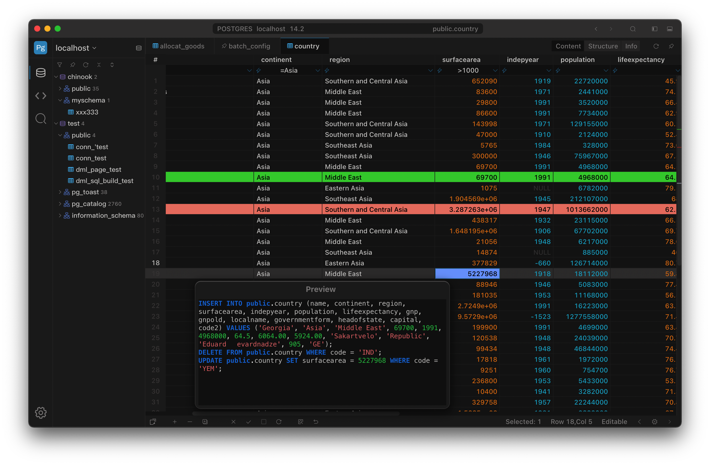

  

  <h1>SteelSQL</h1>
  

  

    
Next generation Database manage tooling

    
    <h3 align="center">This repository is currently being used for hosting the official issue & bug tracker  </h3>
    

<!-- 

<a href="https://#">documents</a>

  -->

 

<h2>SteelSQL</h2>

🎉 Exciting news! Our software is now officially live on the Apple App Store! Download it today and experience innovation at your fingertips. Thank you for your support! 🚀✨🚀✨

<h3>
SteelSQL is free and has no limit on trial time
We would be thrilled if you purchased a license to support development!
</h3>

<a href="#">    
<!--  -->
Download from Apple app stroe
</a> 

(windows,linux coming soon)

SteelSQL is a cross-platform database management tool supporting mac,(windows,linux coming soon)

SteelSQL is the most advanced database management solution designed to meet the needs of developers, data professionals, and organizations striving for seamless data operations. Combining powerful features with an intuitive interface, it is ideal for managing any database environment.

Say goodbye to complexity and embrace efficiency! SteelSQL is a database management tool for the modern developer, combining powerful features with an elegant design to help you navigate the ocean of data with ease.

Perfectly supports oracle in Apple Silicon Mac!

### Why SteelSQL?

1. **Multiple Databases Support**: Whether you are using MySQL/MariaDB, PostgreSQL, Oracle, Sqlite, or SQL Server, SteelSQL simplifies connectivity between multiple database systems. Say goodbye to compatibility issues and use a unified interface for all your data needs!

2. **Efficient Data Filtering**: Provide unprecedented data filtering methods, which can greatly improve the filtering efficiency and user experience, grouping filtering like Excel to edit data, and provide perfect customization support to adapt to a variety of complex database requirements.

3. **Intelligent Code Completion**: Writing complex queries has never been easier with SteelSQL's intelligent code completion and syntax highlighting features. Our advanced SQL editor increases your productivity and lets you focus on creating the best queries without the hassle.

4. **Visual Database Design**: Create and modify database structures effortlessly with our intuitive visual design tools. Supports column, indexex, unique, check, foreignKey editing.

5. **Comprehensive Data Management**: Easily browse, edit and visualize data. With support for cell multi-selection, editing, copying and pasting, SteelSQL allows you to perform batch updates, manage databases, and import/export data with just a few clicks, streamlining your workflow like never before.

6. **Highly Customizable**: Support theme switching, icon colors, SQL editor customization settings, shortcut key definitions for almost all functions, data colors, etc. to create your own database management environment.

### **Experience the Advantages of SteelSQL**

SteelSQL is designed to enhance your database management experience. No more struggling with cumbersome interfaces and complex workflows. Whether you're an experienced database administrator or just starting out, SteelSQL gives you the tools you need to work smarter.

### **Try SteelSQL today!**

Ready to elevate your database management? Experience the power, flexibility and efficiency of SteelSQL. Sign up for a free trial and learn how SteelSQL can change your data management journey and enable you to achieve more than ever before. Let's build the future of data together!

## Information Collection and Use

There are only two ways to communicate externally with SteelSQL.

Checking version information and getting subscription information, this is done by getting a static .json file, the request parameter only contains OS related information such as language, locale, platform, CPU arch, no user related data, it is only used for developer's statistic use, not provided to third party.

SteelSQL uses [Electron crashReporter](https://www.electronjs.org/docs/latest/api/crash-reporter) to get crash data for bug fixing, the data is not provided to third party 

If you downloaded SteelSQL via the Mac App Store, it's possible that the standard data and/or crash reports could be sent back to Apple, or possibly shared with me if you have App Analytics sharing enabled, but I haven't seen that happen yet.

## Contact

For support and inquiries, please contact us at [biz@steelsql.com](mailto:biz@steelsql.com).

